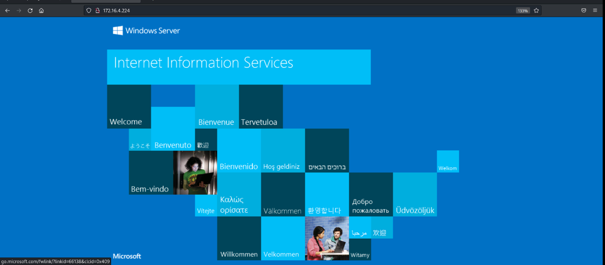
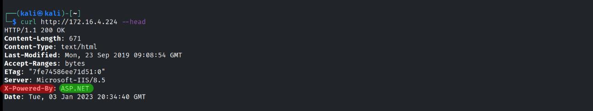
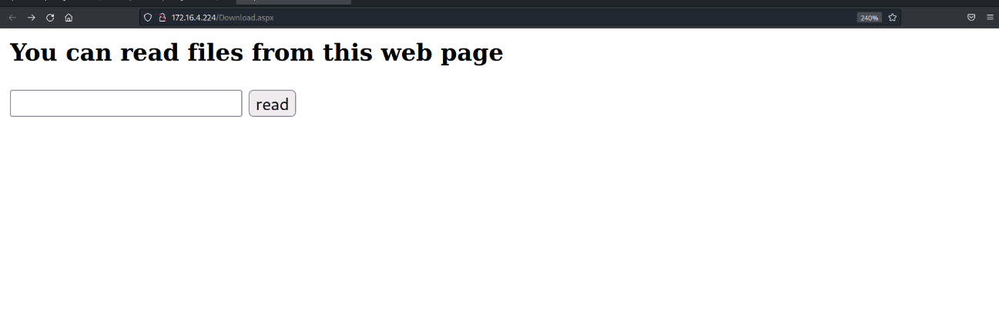
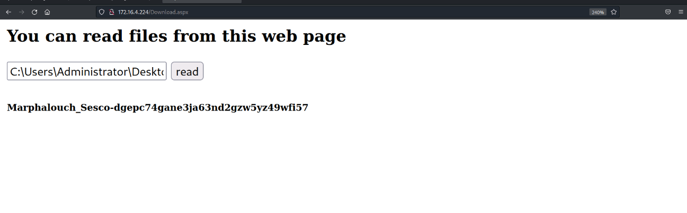

---
title: "SecDojo - T4lk2m3 Lab"
author: [Sesco]
subtitle: "M4rph4l0uch Machine Write Up"
date: "2023-01-01"
keywords: [Windows, Security, CTF, Hacking]
lang: "en"
titlepage: true
titlepage-text-color: "FFFFFF"
titlepage-color: "243763"
titlepage-rule-color: "8ac53e"
...


# Information

- **Name:** T4lk2m3 Lab - M4rph4l0uch Machine
- **Profile:** SecDojo
- **Difficulty:** Medium
- **Description:** The "T4lk to m3" lab, contains two Microsoft Windows machines. To achieve access and obtain the Flags, you will have to conduct an SMB relay attack on those machines. One of those machines contains some SCF files. Learn how to use SCF files to grab juicy pieces of information.


# Enumeration

## Nmap

Initial nmap scan.

```console
$ nmap -Pn -sC -sV 172.16.4.42
Starting Nmap 7.92 ( https://nmap.org ) at 2023-01-01 16:51 UTC
Nmap scan report for 172.16.4.42
Host is up (0.00033s latency).
Not shown: 993 filtered tcp ports (no-response)
PORT      STATE SERVICE            VERSION
80/tcp    open  http               Microsoft IIS httpd 8.5
|_http-server-header: Microsoft-IIS/8.5
|_http-title: IIS Windows Server
| http-methods: 
|_  Potentially risky methods: TRACE
135/tcp   open  msrpc              Microsoft Windows RPC
139/tcp   open  netbios-ssn        Microsoft Windows netbios-ssn
445/tcp   open  microsoft-ds       Microsoft Windows Server 2008 R2 - 2012 microsoft-ds
3389/tcp  open  ssl/ms-wbt-server?
|_ssl-date: 2023-01-01T16:53:08+00:00; +1s from scanner time.
| ssl-cert: Subject: commonName=WIN-0CHLK1AJTI8
| Not valid before: 2022-12-31T15:36:12
|_Not valid after:  2023-07-02T15:36:12
| rdp-ntlm-info: 
|   Target_Name: WIN-0CHLK1AJTI8
|   NetBIOS_Domain_Name: WIN-0CHLK1AJTI8
|   NetBIOS_Computer_Name: WIN-0CHLK1AJTI8
|   DNS_Domain_Name: WIN-0CHLK1AJTI8
|   DNS_Computer_Name: WIN-0CHLK1AJTI8
|   Product_Version: 6.3.9600
|_  System_Time: 2023-01-01T16:52:28+00:00
49154/tcp open  msrpc              Microsoft Windows RPC
49155/tcp open  msrpc              Microsoft Windows RPC
Service Info: OSs: Windows, Windows Server 2008 R2 - 2012; CPE: cpe:/o:microsoft:windows

Host script results:
| smb2-security-mode: 
|   3.0.2: 
|_    Message signing enabled but not required
|_nbstat: NetBIOS name: WIN-0CHLK1AJTI8, NetBIOS user: <unknown>, NetBIOS MAC: 06:98:99:ea:d1:60 (unknown)
| smb2-time: 
|   date: 2023-01-01T16:52:28
|_  start_date: 2023-01-01T15:34:49
| smb-security-mode: 
|   account_used: guest
|   authentication_level: user
|   challenge_response: supported
|_  message_signing: disabled (dangerous, but default)

Service detection performed. Please report any incorrect results at https://nmap.org/submit/ .
Nmap done: 1 IP address (1 host up) scanned in 117.53 seconds
zsh: segmentation fault  nmap -Pn -sC -sV 172.16.4.42
```

We can see that port **80** is open let's check it out.



Nothing really special, but using `curl` utility to grab Http Response Headers I found out that the server side technology used is `ASP.NET`.



Before that I tried to do a Dictionary Brute-Force Attack using `dirb` utility but I didn't find much so I did another one but this time I've added the [**.aspx**](https://docs.fileformat.com/web/aspx/) extension so dirb can try it with its dictionary list.

```console
dirb http://172.16.4.224 -X .aspx                         

--------------------
DIRB v2.22    
By The Dark Raver
--------------------

START_TIME: Tue Jan  3 19:49:59 2023
URL_BASE: http://172.16.4.224/
WORDLIST_FILES: /usr/share/dirb/wordlists/common.txt
EXTENSIONS_LIST: (.aspx) | (.aspx) [NUM = 1]

--------------------

GENERATED WORDS: 4612                                                          

---- Scanning URL: http://172.16.4.224/ ----
+ http://172.16.4.224/download.aspx (CODE:200|SIZE:1538)                                                                                         
+ http://172.16.4.224/Download.aspx (CODE:200|SIZE:1538)                                                                                         
+ http://172.16.4.224/files.aspx (CODE:200|SIZE:1547)                                                                                            
                                                                                                                                                 
--------------------
END_TIME: Tue Jan  3 19:50:05 2023
DOWNLOADED: 4612 - FOUND: 3
```

Found three pages but they look like the same.



After reading the big headline I started manipulating the input then I found out that you can specify a path to any file and it will be displayed.

## Root Flag

Typed `C:\Users\Administrator\Desktop\proof.txt` and that was the result.



**Flag:** **`Marphalouch_Sesco-dgepc74gane3ja63nd2gzw5yz49wfi57`**